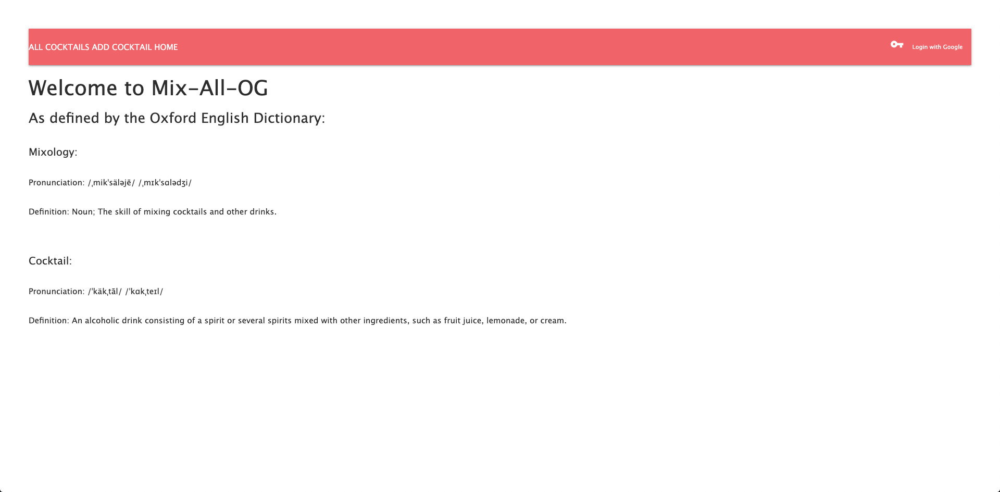
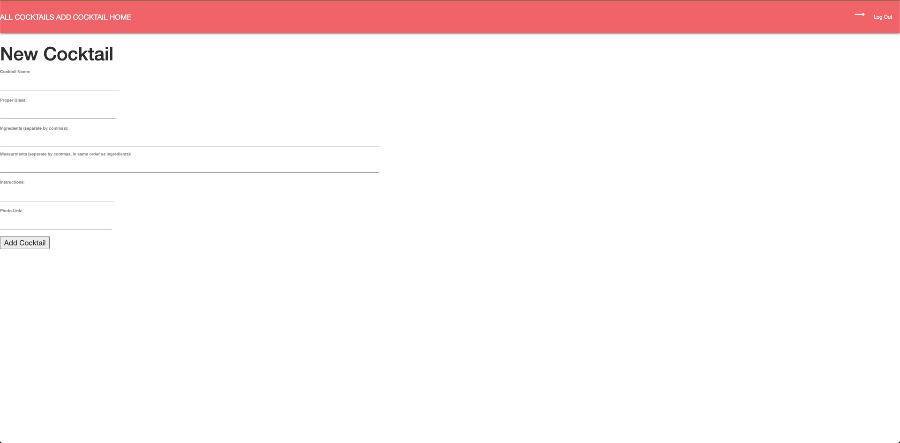
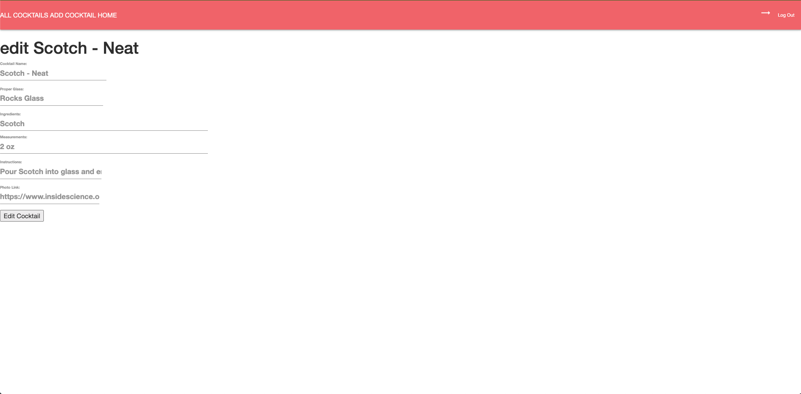
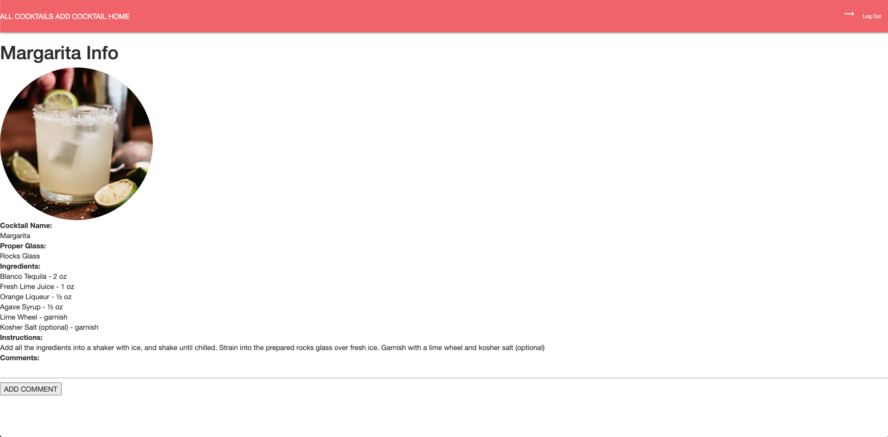
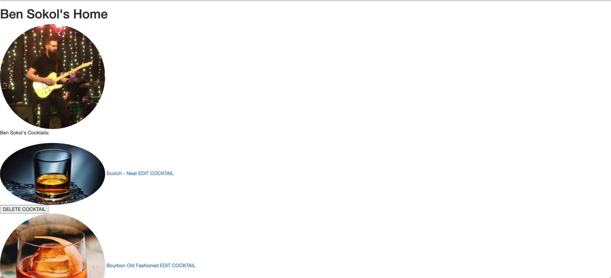
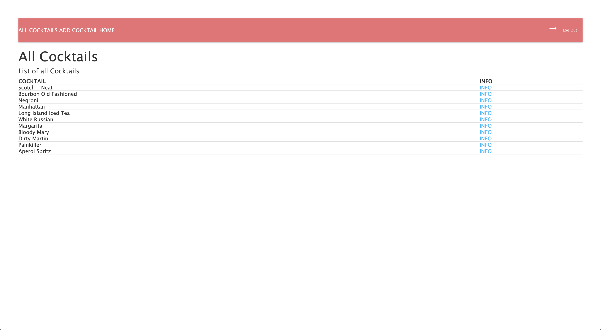

# Mix-All-OG

### This is an app for finding cocktail recipes. Users can browse through a list of cocktails, create their own cocktails, and comment on cocktails. Each cocktail has a list of ingredients and their measurements, a proper glass type, instructions, and an optional photo.

## Screen Shots

## Technologies Used

- MongoDB
- Express.JS
- Node.JS

## Getting Started

[Link to app](https://mix-all-og.herokuapp.com/)
[Link to Trello](https://trello.com/b/0e52V8mp/mix-all-og)

## Next Steps

### I plan on implementing several icebox items, including, but not limited to:

- Implementing cocktail-db API
- Styling
- Add User Favorites
- List all comments created by a user
- Search feature for cocktails, ingredients, glass types
- Add more CRUD functionality to comments
- Add ratings system to cocktails